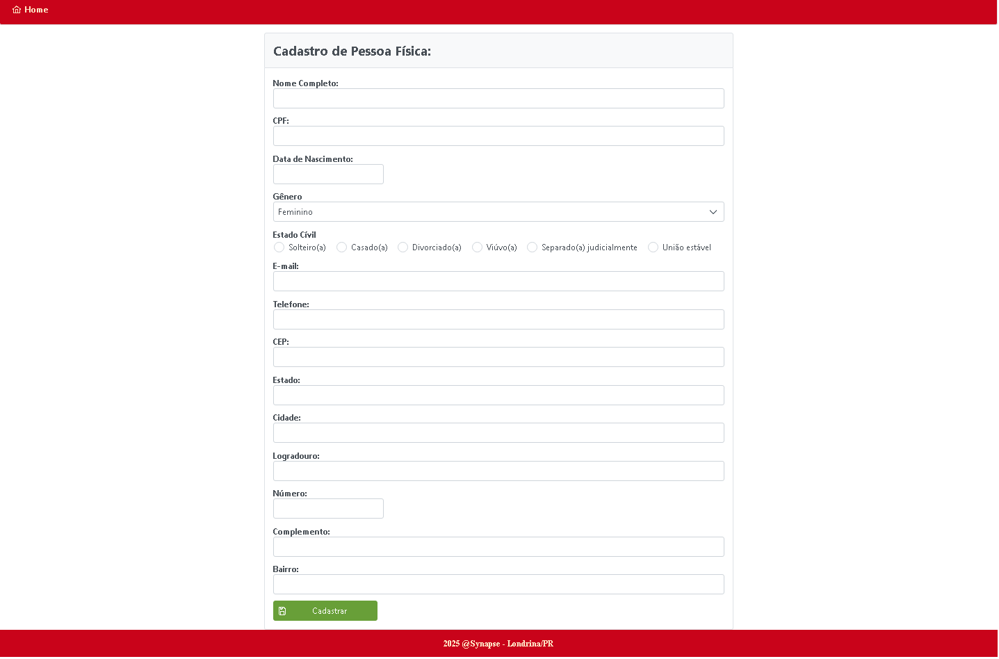
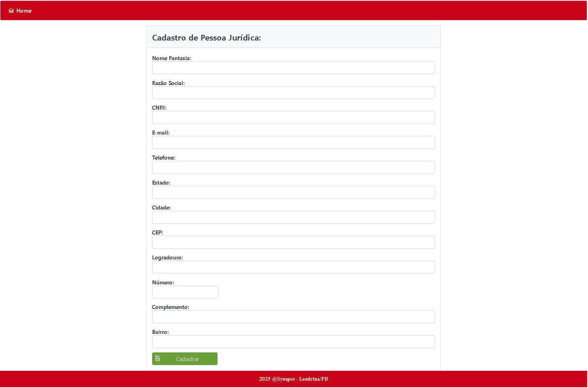
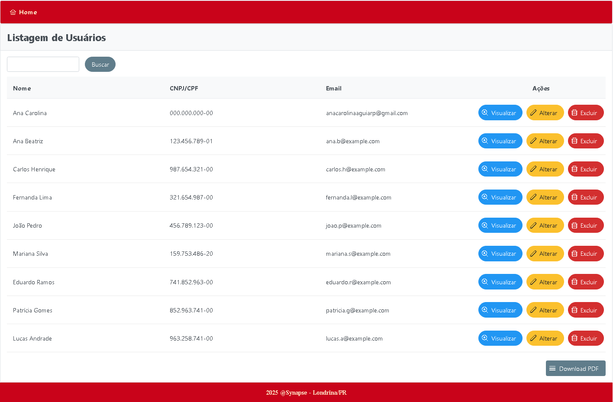

<h1>Projeto CRUD JSF - Synapse</h1>
<p>⚠️ Este projeto ainda está em desenvolvimento e parte das integrações entre o front-end e os microsserviços está pendente.</p>
<p>Synapse é uma aplicação modular voltada para a gestão de pessoas, que integra microsserviços para oferecer funcionalidades de cadastro e manutenção de Pessoa Física e Pessoa Jurídica, além de geração e download de relatórios.</p>
<p>A interface front-end é desenvolvida em JSF, proporcionando uma experiência interativa e responsiva, enquanto o back-end é composto por microsserviços independentes que garantem escalabilidade, flexibilidade e manutenção facilitada.</p>

<p>O projeto visa facilitar a organização, consulta e análise de dados relacionados a pessoas dentro de organizações, promovendo uma gestão eficiente e integrada.</p>

<h2>Ferramentas Utilizadas</h2>
<ul>
    <li>Java v17(JSF) e v24(Microsserviços)</li>
    <li>SpringBoot</li>
    <li>JSF (PrimeFaces) com Tomcat</li>
    <li>MySQL</li>
</ul>

<h2>Estrutura do Projeto</h2>

```
projeto-sistema/
├── pessoa-fisica-service/           # Microserviço responsável pela Pessoa Física
│   ├── src/
│   │   └── main/
│   │       ├── java/com/microservicos/pessoa_fisica/
│   │       │   ├── PessoaFisicaApplication.java      # Classe principal (Spring Boot)
│   │       │   ├── controller/                       # Endpoints REST
│   │       │   ├── entity/                           # Entidade JPA (tabela Pessoa Física)
│   │       │   ├── model/                            # DTOs e VOs (dados de entrada/saída)
│   │       │   ├── repository/                       # Interfaces JPA para acesso ao banco
│   │       │   └── service/                          # Regras de negócio
│   │       └── resources/application.properties      # Configurações do microserviço
│   └── Dockerfile                                    # Container do serviço
│
├── pessoa-juridica-service/         # Microserviço responsável pela Pessoa Jurídica
│   ├── src/
│   │   └── main/
│   │       ├── java/com/microservicos/pessoa_juridica/
│   │       │   ├── PessoaJuridicaApplication.java    # Classe principal (Spring Boot)
│   │       │   ├── controller/                       # Endpoints REST
│   │       │   ├── entity/                           # Entidade JPA (tabela Pessoa Jurídica)
│   │       │   ├── model/                            # DTOs e VOs (dados de entrada/saída)
│   │       │   ├── repository/                       # Interfaces JPA para acesso ao banco
│   │       │   └── service/                          # Regras de negócio
│   │       └── resources/application.properties      # Configurações do microserviço
│   └── Dockerfile                                    # Container do serviço
│
├── relatorio-service/              # Microserviço para gerar relatórios com dados combinados
│   ├── src/
│   │   └── main/
│   │       ├── java/com/microservicos/relatorio/
│   │       │   ├── RelatorioApplication.java         # Classe principal
│   │       │   ├── controller/                       # Endpoints REST para relatórios
│   │       │   ├── dto/                              # Dados de resposta dos relatórios
│   │       │   └── service/                          # Lógica de geração de relatórios
│   │       └── resources/application.properties
│   └── Dockerfile
│
└── FrontEnd/                        # Interface do usuário (JSF + PrimeFaces)
    ├── src/
    │   └── main/
    │       ├── java/com/projeto/
    │       │   ├── bean/                             # Managed Beans (JSF) com lógica das páginas
    │       │   └── model/                            # Classes modelo/DTO usadas no front
    │       └── webapp/
    │           ├── home.xhtml                        # Página home do sistema
    │           ├── usuario/                          # Telas JSF de CRUD (PF e PJ)
    │           ├── resources/
    │           │   ├── css/                          # Estilos visuais
    │           │   └── js/                           # Scripts auxiliares (validações, api-correios)
    │           └── WEB-INF/
    │               ├── web.xml                       # Configuração JSF
    │               └── templates/template.xhtml      # Template visual comum às páginas
    └── Dockerfile
```
<h2>Telas</h2>
<h3>Página Inicial</h3>

<h3>Cadastro de Pessoa Física</h3>

<h3>Cadastro de Pessoa Jurídica</h3>

<h3>Listagem de Usuários</h3>


<h2>Créditos</h2>
<p>É válido ressaltar nosso agradecimento especial a nosso gestor <strong>Nelson Konishi</strong> que nos prestou todo apoio e nos permitiu explorar os conhecimentos adquiridos, além de nos guiar muito bem, realmente se comprometendo com nosso aprendizado. Também os créditos ao <strong>Felipe Henrique</strong> que nos ajudou muito na base de conhecimento em JSF e microserviços, se disponibilizando também para nos auxiliar no que fosse possível. Nosso muito obrigada!</p>
